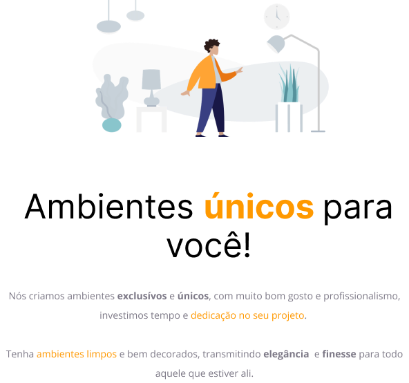

  

## 🖥️ Projeto

Esse é um projeto Web para uma fábrica de móveis.

## 🚀 Tecnologias

Esse projeto foi desenvolvido durante o curso Explorer da Rocketseat com as seguintes tecnologias:

- HTML
- CSS
- Git e Github

## 🏷️ LAYOUT

Você pode visualizar o layout do projeto através
[desse link](<https://www.figma.com/file/izA56MvStkQbI2iSfncT4n/Explorer---Projeto-01-(Copy)?type=design&node-id=0-1&t=NP6yx3RSeQ24ven8-0>).
É necessário ter uma conta no [Figma](https://www.figma.com).
